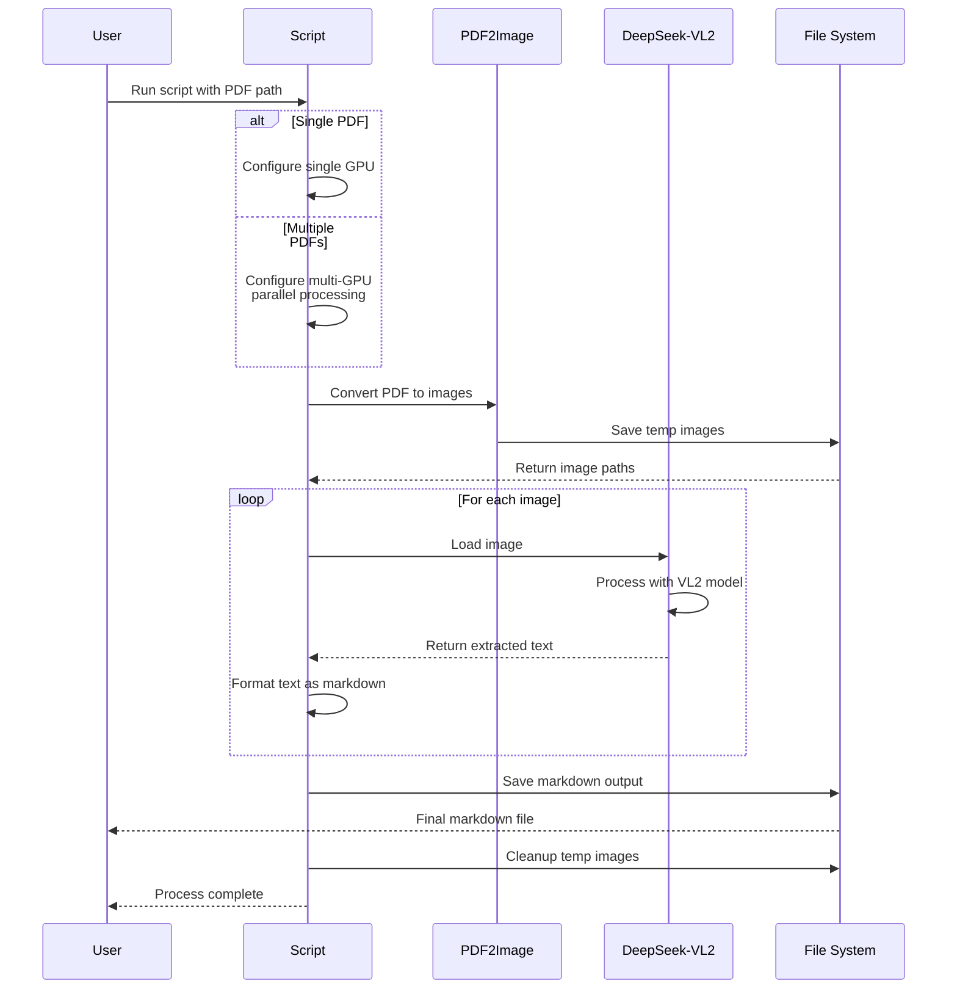

# deepseekvl2-PDF-OCR-private
Privately (locally) extract text from PDF files using state-of-the-art DeepSeek-VL2 model - Support for single PDF processing and batch processing. (NVIDIA CUDA)

## Author
- **Nicolas Cravino**
- Created: February 9, 2025
- Contact: [GitHub Issue Tracker](https://github.com/spidernic/deepseek-ocr/issues)

## References

This project uses the DeepSeek-VL2 model:

<details>
<summary>Click to show BibTeX citation</summary>

```bibtex
@misc{wu2024deepseekvl2mixtureofexpertsvisionlanguagemodels,
    title={DeepSeek-VL2: Mixture-of-Experts Vision-Language Models for Advanced Multimodal Understanding},
    author={Wu, Zhiyu and Chen, Xiaokang and Pan, Zizheng and Liu, Xingchao and Liu, Wen and Dai, Damai and 
            Gao, Huazuo and Ma, Yiyang and Wu, Chengyue and Wang, Bingxuan and Xie, Zhenda and Wu, Yu and 
            Hu, Kai and Wang, Jiawei and Sun, Yaofeng and Li, Yukun and Piao, Yishi and Guan, Kang and 
            Liu, Aixin and Xie, Xin and You, Yuxiang and Dong, Kai and Yu, Xingkai and Zhang, Haowei and 
            Zhao, Liang and Wang, Yisong and Ruan, Chong},
    year={2024},
    eprint={2412.10302},
    archivePrefix={arXiv},
    primaryClass={cs.CV},
    url={https://arxiv.org/abs/2412.10302}
}
```

</details>

## Features
- Extract text from PDF files using state-of-the-art DeepSeek-VL2 model
- Support for single PDF processing and batch processing
- Enhanced parallel processing using multiple GPUs for faster extraction (custom modification to DeepSeek-VL2's inference code)
- Markdown output format for easy readability and further processing
- Progress tracking with detailed logging
- Support for different model sizes (tiny, small, base)

## Requirements
- Python 3.10 or higher
- CUDA-capable GPU(s)
- 24GB+ GPU memory for tiny model, 40GB+ for larger models
- Windows/Linux operating system

## Setup

1. Install dependencies:
```bash
pip install -r requirements.txt
```

2. Install DeepSeek-VL2:
```bash
git clone https://github.com/deepseek-ai/DeepSeek-VL2.git
cd DeepSeek-VL2
pip install -e .
```

3. Apply multi-GPU support patch:
```bash
python patches/apply_patches.py
```
This will automatically backup the original `inference.py` and apply our modified version with multi-GPU support.

## Usage

### Process Flow



### Single PDF Processing
```bash
python ocr.py --model_name deepseek-ai/deepseek-vl2-tiny --pdf_path <path_to_pdf> --output_path <output_path>
```

### Multiple PDFs with Parallel Processing
To process multiple PDFs in parallel using multiple GPUs, simply provide a directory path:
```bash
python ocr.py --model_name deepseek-ai/deepseek-vl2-tiny --pdf_path <path_to_directory>
```
The script will automatically:
- Detect all PDF files in the directory
- Use all available GPUs for parallel processing
- Distribute the workload across GPUs for faster processing

### Arguments
- `--model_name`: Model to use (deepseek-ai/deepseek-vl2-tiny, deepseek-ai/deepseek-vl2-small, or deepseek-ai/deepseek-vl2)
- `--pdf_path`: Path to a PDF file or directory containing multiple PDFs
- `--output_path`: (Optional) Path where to save the extracted text (in markdown format). If not specified, output will be saved in the same directory as the input

## Output

The script will:
1. Convert each PDF page to an image
2. Process each image with DeepSeek-VL2 to extract text
3. Save the combined output as a markdown file

When processing multiple PDFs in parallel:
- Each PDF gets processed by a dedicated GPU
- Progress is shown for each PDF separately
- Output files are created in the same directory structure as the input

## Advanced Configuration

### Model Selection
Choose the appropriate model based on your needs:
- `deepseek-ai/deepseek-vl2-tiny`: Fastest, lowest memory requirements (~8GB VRAM)
- `deepseek-ai/deepseek-vl2-small`: Better quality, moderate speed (~12GB VRAM)
- `deepseek-ai/deepseek-vl2`: Best quality, slower processing (~16GB VRAM)

### Memory Optimization
If you encounter memory issues:
1. Use the tiny model variant
2. Reduce batch size (default is optimized for 8GB VRAM)
3. Process fewer pages in parallel

### Error Handling
Common issues and solutions:
- **CUDA out of memory**: Try using a smaller model or reducing batch size
- **PDF conversion error**: Ensure PDF is not password protected and is readable
- **Multiple GPU issues**: Ensure all GPUs have sufficient memory and are CUDA-capable

## Examples

### Basic Usage
```bash
# Process a single PDF
python ocr.py --model_name deepseek-ai/deepseek-vl2-tiny --pdf_path document.pdf

# Process multiple PDFs in parallel
python ocr.py --model_name deepseek-ai/deepseek-vl2-tiny --pdf_path ./pdf_directory

# Specify custom output location
python ocr.py --model_name deepseek-ai/deepseek-vl2-tiny --pdf_path document.pdf --output_path ./output/
```

## Output Format
The extracted text is saved in markdown format with the following structure:
```markdown
# [PDF Filename]

## Page 1
[Extracted text from page 1]

## Page 2
[Extracted text from page 2]
...
```

## Contributing
Contributions are welcome! Please feel free to submit a Pull Request.

## License

This project has a dual licensing structure:

### Project Code License (Apache 2.0)

The code in this repository is licensed under the Apache License 2.0:

```
Copyright 2025 Nicolas Cravino

Licensed under the Apache License, Version 2.0 (the "License");
you may not use this file except in compliance with the License.
You may obtain a copy of the License at

    http://www.apache.org/licenses/LICENSE-2.0

Unless required by applicable law or agreed to in writing, software
distributed under the License is distributed on an "AS IS" BASIS,
WITHOUT WARRANTIES OR CONDITIONS OF ANY KIND, either express or implied.
See the License for the specific language governing permissions and
limitations under the License.
```

### DeepSeek-VL2 Model License

The DeepSeek-VL2 model used in this project is subject to the DeepSeek License Agreement and the MIT License:
- Model weights and architecture are under the [DeepSeek License](https://github.com/deepseek-ai/DeepSeek-VL2/blob/main/LICENSE-MODEL)
- Model code is under the [MIT License](https://github.com/deepseek-ai/DeepSeek-VL2/blob/main/LICENSE-CODE)

Please ensure you comply with both licenses when using this project.

## Acknowledgments
- DeepSeek-VL2 team for their amazing model (with custom modifications to `inference.py` for multi-GPU support)
- PDF2Image library for PDF conversion
- PyTorch team for the deep learning framework

## Technical Details

### Multi-GPU Processing
The project includes custom modifications to DeepSeek-VL2's `inference.py` module to enable efficient multi-GPU processing:
- Enhanced device management for parallel processing
- Modified stopping criteria to work correctly across multiple GPUs
- Improved tensor device handling for multi-GPU inference

To use these modifications:
1. The original DeepSeek-VL2 `inference.py` will be automatically backed up as `inference.py.backup`
2. Our modified version will be installed by running `python patches/apply_patches.py`
3. If you need to revert the changes, simply restore the `.backup` file

## Troubleshooting
1. **Installation Issues**
   - Ensure you have the correct CUDA version installed
   - Try creating a fresh conda environment
   - Check Python version compatibility

2. **Runtime Issues**
   - Monitor GPU memory usage
   - Check PDF file permissions
   - Verify input file paths

3. **Output Issues**
   - Ensure write permissions in output directory
   - Check available disk space
   - Verify PDF is not corrupted

## Contact
For issues and feature requests, please use the GitHub issue tracker.
